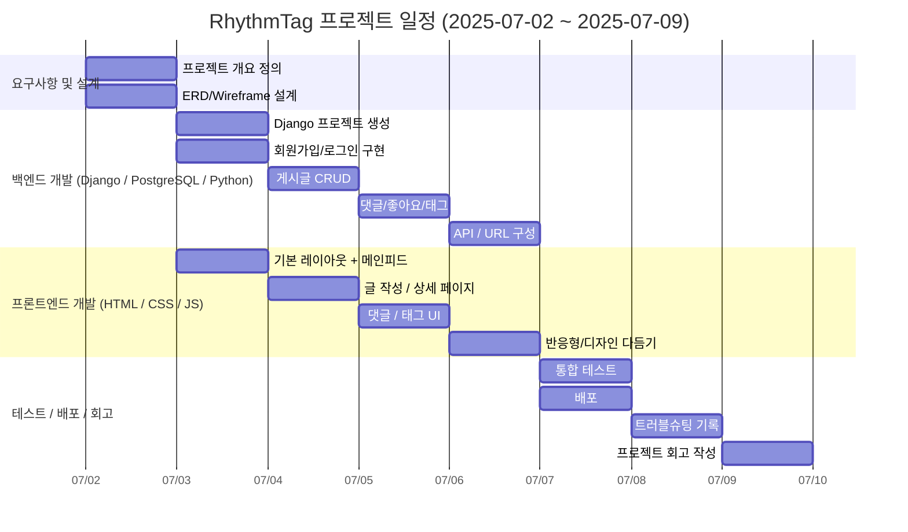

# RhythmTag🕺
태그를 포함하여 노래를 추천하고 공유하는 음악블로그

---

## 1️⃣ 프로젝트 개요
RhythmTag는 YouTube 링크를 기반으로 사용자가 노래를 추천하고,  
태그와 함께 공유하며, 다른 사용자의 추천곡을 탐색할 수 있는  
인스타그램형 음악 블로그 커뮤니티입니다.

주요 기능:
- YouTube 링크를 통한 노래 공유
- 태그 기반 곡 분류 및 탐색
- 댓글, 좋아요 기능
- 모바일 반응형 UI

---

## 2️⃣ 기술 스택
- **Frontend:** HTML, CSS, JavaScript (Vanilla / Bootstrap)
- **Backend:** Python, Django
- **Database:** PostgreSQL
- **Etc:** GitHub, Figma, YouTube API

---

## 3️⃣ 프로젝트 실행 방법
# 가상환경 실행
source venv/bin/activate  # Mac/Linux
venv\Scripts\activate  # Windows

# 패키지 설치
pip install -r requirements.txt

# 서버 실행
python manage.py runserver

--- 

## 4️⃣ 기능 구성
* 회원가입 / 로그인 / 로그아웃
* 게시글 작성 / 수정 / 삭제 (YouTube 링크 포함)
* 태그 등록 / 검색
* 댓글 작성 / 삭제
* 좋아요
* 메인 피드 (최신 추천곡 리스트)
* 태그별 피드
* 팔로잉 / 팔로워 / 팔로잉삭제

---

# 5️⃣ ERD

---

# 6️⃣ URL 구성

---

# 7️⃣ WireFrame

---

# 8️⃣ 일정표 (WBS)

---

# 9️⃣ 시연 내용

---

# 🔟 트러블슈팅

---

# 1️⃣1️⃣ 프로젝트 진행하며 느낀 점
